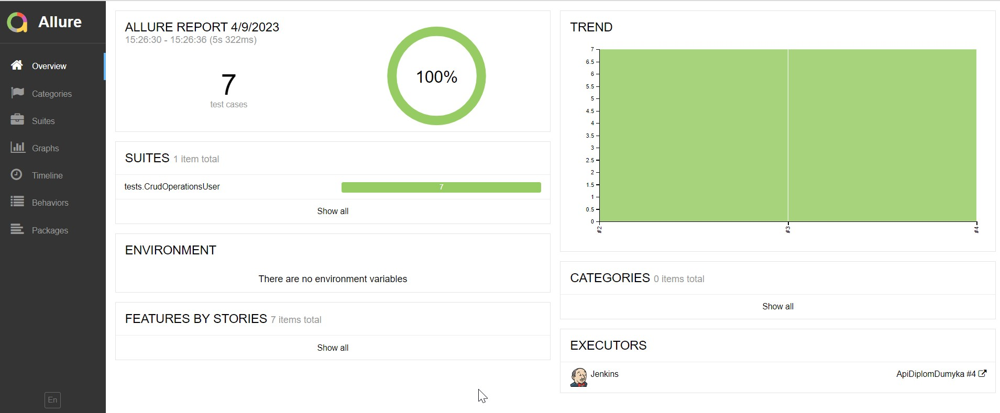
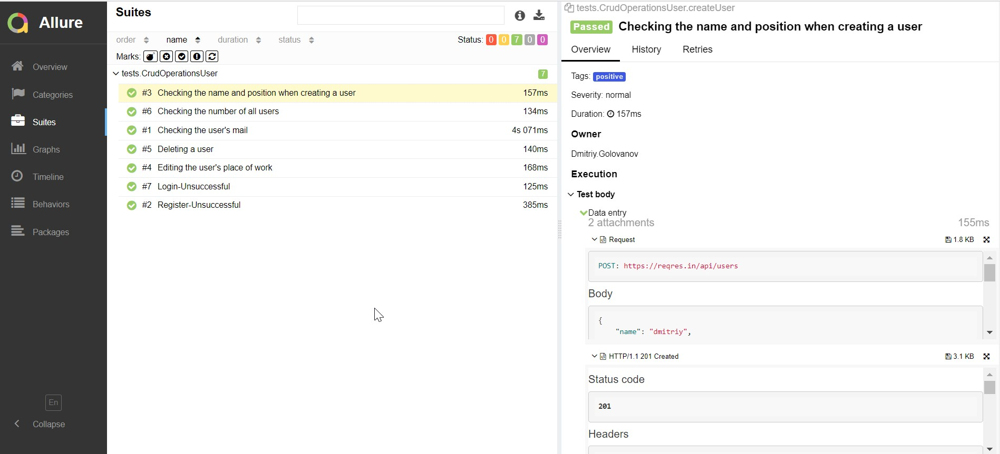
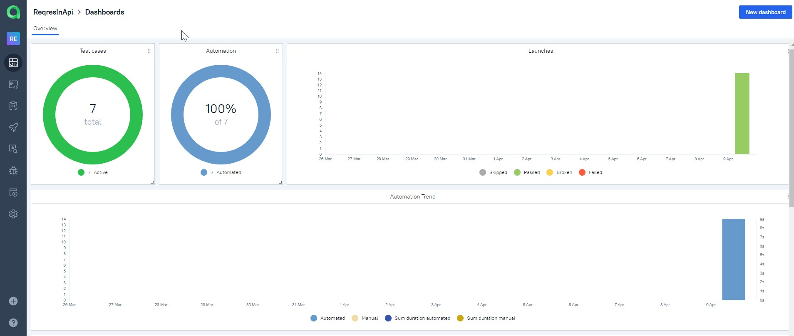

# Проект по автоматизации тестирования API сервиса Reqres


## :man_student:: Содержание:

- [Стек технологий](#earth_africa-Стек-технологий)
- [Реализованные проверки](#earth_africa-Реализованные-проверки)
- [Сборка в Jenkins](#earth_africa-Jenkins-job)
- [Запуск из терминала](#earth_africa-Запуск-тестов-из-терминала)
- [Allure отчет](#earth_africa-Allure-отчет)
- [Интеграция с Allure TestOps](#earth_africa-Интеграция-c-Allure-TestOps)
- [Уведомления в Telegram](#earth_africa-Уведомление-в-Telegram-при-помощи-бота)

## 🧰: Стек технологий

<p align="center">
<a href="https://www.jetbrains.com/idea/"></a>
<a href="https://www.java.com/"></a>
<a href="https://github.com/"></a>
<a href="https://junit.org/junit5/"></a>
<a href="https://gradle.org/"></a>
<a href="https://github.com/allure-framework/allure2"></a>
<a href="https://https://qameta.io/"></a>
<a href="https://www.jenkins.io/"></a>
<a href="https://https://telegram.org/"></a>
</p>

## :male_detective:: Реализованные проверки

- ✓ POST/api/users - создание учетной записи пользователя
- ✓ GET/api/users/2 - получение информации о пользователе
- ✓ PATCH/api/users/2 - редактирование учетной записи пользователя
- ✓ DELETE/api/users/2 - удаление учетной записи пользователя
- ✓ GET/api//users?page=2 - получение списка пользователей
- ✓ POST/api/login - вход в систему
-  ✓ POST/api/register - регистрация в системе

## </a> Сборка <a target="_blank" href="https://jenkins.autotests.cloud/job/017-dumyka-itavia/"> Jenkins </a>
<p align="center">
<a href="https://jenkins.autotests.cloud/job/ApiDiplomDumyka/"></a>
</p>

## 🧪: Пример авто-тест кейса
<p align="center">

</p>

## :rocket:: Запуск тестов из терминала
Локальный запуск:
```
gradle clean test
```
При необходимости можно переопределить параметры запуска:
```
gradle clean
test/positive/negative - все тесты/позитивные/негативные
```

Удаленный запуск:
```
clean test
```

При необходимости можно переопределить параметры запуска:
```
clean
test/positive/negative - все тесты/позитивные/негативные
```

## </a> Allure отчет <a target="_blank" href="https://jenkins.autotests.cloud/job/IBS_test/allure/"></a>

## ⛅: Основной отчет
<p align="center">

</p>

## </a> Интеграция с Allure TestOps <a target="_blank" href="https://allure.autotests.cloud/project/1858/dashboards"></a>

## :bar_chart:: Доска
<p align="center">

</p>
